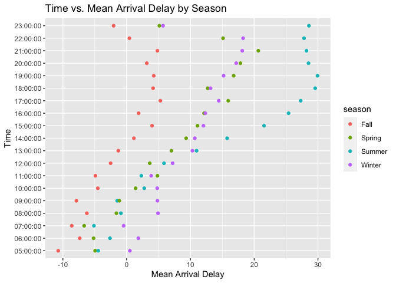
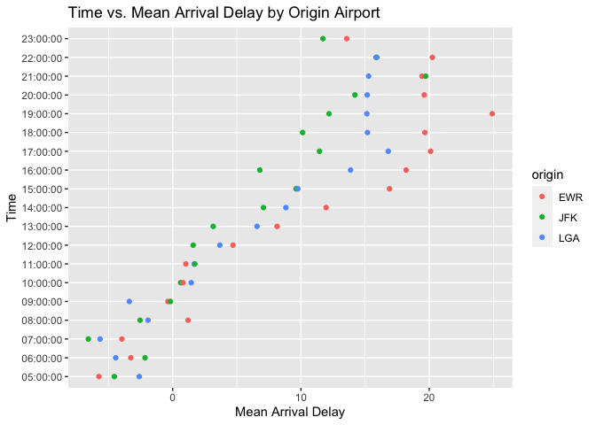
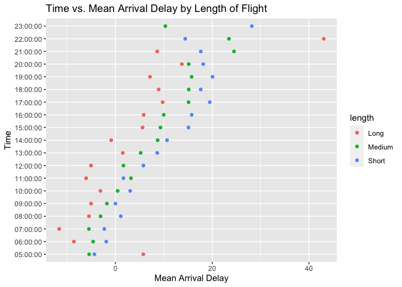

HW2
================
2022-10-04

[HW2](https://github.com/DrakeYoder/HW2-STAT433-.git)

``` r
#What time of day should you fly if you want to avoid delays as much as possible? Does this choice depend on anything? Season? Weather? Airport? Airline? Find three patterns (“null results” are ok!). Include a short introduction that summarizes the three results. Then, have a section for each finding. Support each finding with data summaries and visualizations.

# In general, flights that are earlier in the day have less arrival delay than flights later. My findings conclude that fall is the best season to fly in to avoid arrival delays, perhaps because it is when most people are just starting school. The next finding is that the JFK airport has less arrival delay on average while the EWR airport had the most. Lastly, longer flights tended to have less delays maybe because you are able to make up for lost time the longer you are in the air. If you want the best chance for a flight with little arrival delay, take a long flight (> 2000 mi) from JFK in the fall as early as possible in the day.

# Flight delays by hour of day:
flights %>% filter(!is.na(arr_delay)) %>% mutate(time_hour = substr(as.character(time_hour), 12, 20)) %>% group_by(time_hour) %>% summarise(mean_arr_delay = mean(arr_delay), n = n()) %>% arrange(mean_arr_delay, decreasing = F)
```

    ## # A tibble: 19 × 3
    ##    time_hour mean_arr_delay     n
    ##    <chr>              <dbl> <int>
    ##  1 07:00:00          -5.30  22475
    ##  2 05:00:00          -4.80   1940
    ##  3 06:00:00          -3.38  25447
    ##  4 09:00:00          -1.45  19931
    ##  5 08:00:00          -1.11  26734
    ##  6 10:00:00           0.954 16370
    ##  7 11:00:00           1.48  15689
    ##  8 12:00:00           3.49  17744
    ##  9 13:00:00           6.54  19457
    ## 10 14:00:00           9.20  21022
    ## 11 23:00:00          11.8    1042
    ## 12 15:00:00          12.3   23082
    ## 13 16:00:00          12.6   22045
    ## 14 18:00:00          14.8   21072
    ## 15 22:00:00          16.0    2558
    ## 16 17:00:00          16.0   23667
    ## 17 19:00:00          16.7   20507
    ## 18 20:00:00          16.7   16061
    ## 19 21:00:00          18.4   10503

``` r
# Finding 1 (Season): It appears that fall has the lowest arrival delays while summer has the worst. Spring and winter are fairly equal in arrival delay times. However, the spread between these delays become smaller the earlier in the day the flight is.
season = flights %>% filter(!is.na(arr_delay)) %>% mutate(time_hour = substr(as.character(time_hour), 12, 20), season = case_when((month < 3) | (month > 11) ~ "Winter", (month >= 3) & (month < 6) ~ "Spring", (month >= 6) & (month < 9) ~ "Summer", (month >= 9) & (month < 12) ~ "Fall")) %>% group_by(time_hour, season) %>% summarise(mean_arr_delay = mean(arr_delay), n = n()) %>% arrange(mean_arr_delay, decreasing = F)
```

    ## `summarise()` has grouped output by 'time_hour'. You can override using the
    ## `.groups` argument.

``` r
season
```

    ## # A tibble: 76 × 4
    ## # Groups:   time_hour [19]
    ##    time_hour season mean_arr_delay     n
    ##    <chr>     <chr>           <dbl> <int>
    ##  1 05:00:00  Fall           -10.7    454
    ##  2 07:00:00  Fall            -8.61  5715
    ##  3 09:00:00  Fall            -7.88  4827
    ##  4 06:00:00  Fall            -7.36  6078
    ##  5 07:00:00  Spring          -6.66  5606
    ##  6 08:00:00  Fall            -6.24  7223
    ##  7 06:00:00  Spring          -5.19  6591
    ##  8 07:00:00  Summer          -5.13  5873
    ##  9 05:00:00  Spring          -4.95   462
    ## 10 11:00:00  Fall            -4.90  3962
    ## # … with 66 more rows

``` r
ggplot(season, aes(mean_arr_delay, time_hour, colour = season)) + 
  geom_point() + xlab("Mean Arrival Delay") + ylab("Time") + ggtitle("Time vs. Mean Arrival Delay by Season")
```

<!-- -->

``` r
# Finding 2 (Origin): It generally appears that the JFK airport has the lowest time delays, LGA has the second lowest, while EWR has the worst. The spread between these delays gets smaller, the earlier in the day the flight is.
origin = flights %>% filter(!is.na(arr_delay)) %>% mutate(time_hour = substr(as.character(time_hour), 12, 20)) %>% group_by(time_hour, origin) %>% summarise(mean_arr_delay = mean(arr_delay), n = n()) %>% arrange(mean_arr_delay, decreasing = F)
```

    ## `summarise()` has grouped output by 'time_hour'. You can override using the
    ## `.groups` argument.

``` r
ggplot(origin, aes(mean_arr_delay, time_hour, colour = origin)) + 
  geom_point() + xlab("Mean Arrival Delay") + ylab("Time") + ggtitle("Time vs. Mean Arrival Delay by Origin Airport")
```

<!-- -->

``` r
# Finding 3 (Distance): It appears that longer flight distances have lower arrival delay compared to shorter flights.
distance = flights %>% filter(!is.na(arr_delay)) %>% mutate(time_hour = substr(as.character(time_hour), 12, 20), length = case_when((distance < 1000) ~ "Short", (distance >= 1000) & (distance < 2000) ~ "Medium", (distance >= 2000) ~ "Long")) %>% group_by(time_hour, length) %>% summarise(mean_arr_delay = mean(arr_delay), n = n()) %>% arrange(mean_arr_delay, decreasing = F)
```

    ## `summarise()` has grouped output by 'time_hour'. You can override using the
    ## `.groups` argument.

``` r
distance
```

    ## # A tibble: 56 × 4
    ## # Groups:   time_hour [19]
    ##    time_hour length mean_arr_delay     n
    ##    <chr>     <chr>           <dbl> <int>
    ##  1 07:00:00  Long           -11.6   4619
    ##  2 06:00:00  Long            -8.59  2589
    ##  3 11:00:00  Long            -6.05  1372
    ##  4 07:00:00  Medium          -5.49  7680
    ##  5 08:00:00  Long            -5.47  3468
    ##  6 05:00:00  Medium          -5.43  1463
    ##  7 12:00:00  Long            -5.05  1970
    ##  8 09:00:00  Long            -5.03  3842
    ##  9 06:00:00  Medium          -4.61  7597
    ## 10 05:00:00  Short           -4.35   406
    ## # … with 46 more rows

``` r
ggplot(distance, aes(mean_arr_delay, time_hour, colour = length)) + 
  geom_point() + xlab("Mean Arrival Delay") + ylab("Time") + ggtitle("Time vs. Mean Arrival Delay by Length of Flight")
```

<!-- -->
